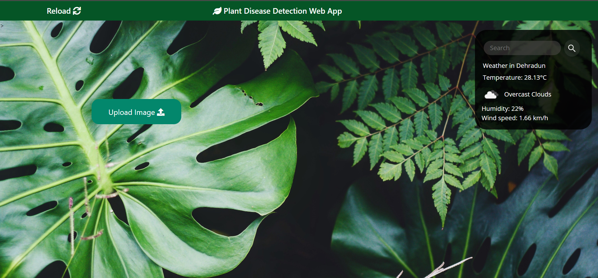

# Plant Disease Detection

A Flask web application that classifies uploaded plant-leaf images with a bundled TensorFlow model. It recognizes 15 classes across bell pepper, potato, and tomato plants, then links to relevant external plant-care information.

## Features

- Upload PNG or JPEG leaf images for classification.
- Predict one of 15 supported healthy or disease classes.
- Show an optional local weather panel when an OpenWeather API key is configured.

## Supported Plants

| Plant | Classes |
| --- | --- |
| Bell pepper | Bacterial spot, healthy |
| Potato | Early blight, late blight, healthy |
| Tomato | Bacterial spot, early blight, late blight, leaf mold, septoria leaf spot, spider mites, target spot, yellow leaf curl virus, mosaic virus, healthy |

## Run Locally

Use Python 3.8 or 3.9 because the bundled model dependencies are pinned to TensorFlow 2.8.

```bash
python3 -m venv .venv
source .venv/bin/activate
pip install -r requirements.txt
export OPENWEATHER_API_KEY="your-key" # optional
python app.py
```

Open `http://127.0.0.1:5000`. Without `OPENWEATHER_API_KEY`, the weather panel stays hidden and image classification still works.

## Project Structure

```text
app.py                       Flask application and image inference
plantDiseaseDetection.h5     Bundled TensorFlow model
Plant_Disease_Detection.ipynb Training and evaluation notebook
trainingData.npy             Saved training-history data
Docs/                        Original report, presentation, and README media
static/ and templates/       Web interface assets
```

## Model and Data

The model file and notebook are included as project artifacts. The notebook's stored evaluation output reports 93.78% test accuracy. This is historical notebook output, not a fresh validation of the current application.

The training dataset is referenced in the [PlantVillage Kaggle dataset](https://www.kaggle.com/datasets/emmarex/plantdisease). Review its terms before downloading or reusing data.

## Limitations

- Predictions cover only the listed 15 classes.
- The displayed value is the model's confidence for its selected class, not a professional plant-health diagnosis.
- Weather depends on the optional OpenWeather service and a user-supplied key.

## Screenshot



## Contributing

See [CONTRIBUTING.md](CONTRIBUTING.md) for project conventions.
